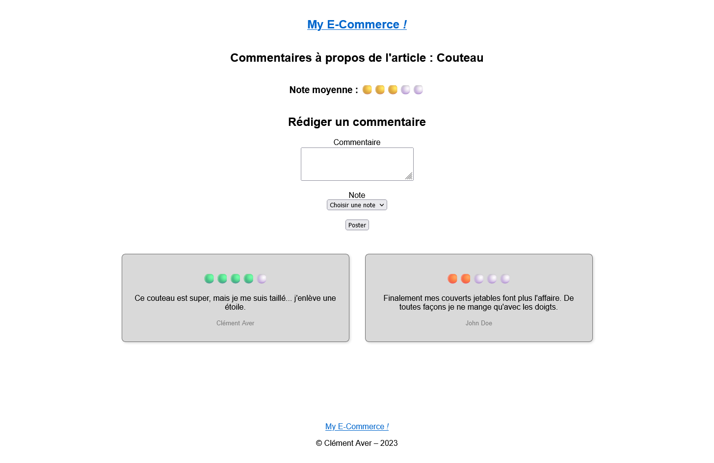

# MyE-Commerce

MyE-Commerce was a personal project, alongside my training as a React application developer, because I wanted to explore other web development processes. I took several online courses and this project helped me to apply what I'd read. Through MyE-Commerce I was able to discover PHP and the MVC model. But also to learn about databases thanks to MySQL.

  

  

  

  

